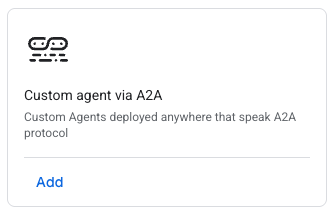
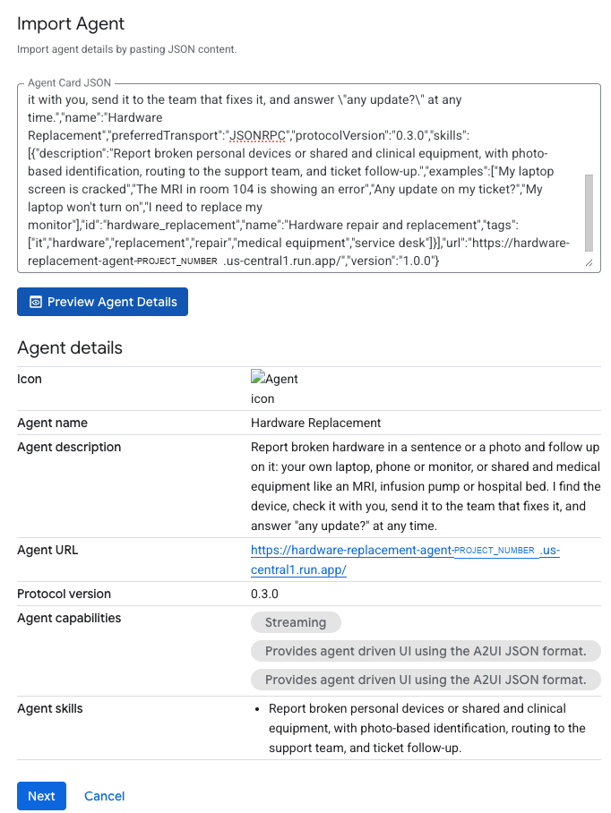
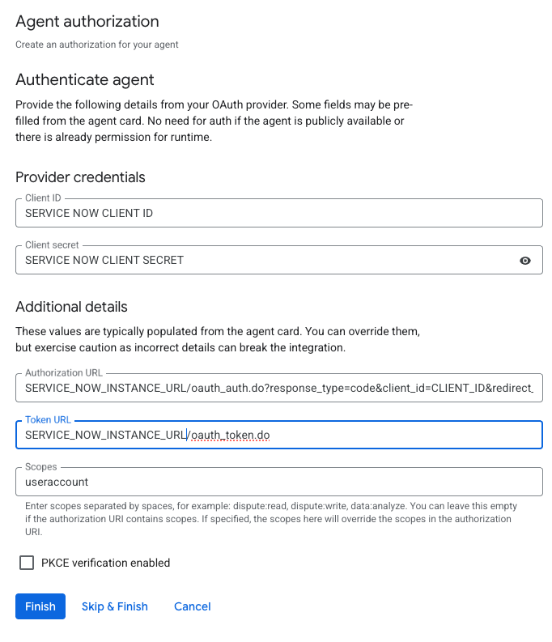

# ServiceNow Hardware Replacement agent

## The Agent

The included agent is built on Google's Agent Development Kit (ADK) and is focused on minimizing the effort
required to report an enterprise hardware issue and have that issue show up as an incident in ServiceNow.

Included along with the agent code are configuration directions for integrating the agent with ServiceNow,
deploying it to Google Cloud (the agent runs on **Cloud Run**; Agent Runtime only stores conversations and
memory) and making it available to users in the Gemini Enterprise app.

The included scripts and demo script are built around a fictitious hospital system with a mix of IT-managed
devices (laptops, monitors, phones, printers) and medical equipment (MRI, CT, X-ray, infusion pumps, patient
monitors, hospital beds), but the agent is easily adapted to any enterprise vertical: names, colours, problem
choices and ServiceNow field mappings live in one configuration file (`config/organization.yaml`), not in code.

The agent uses A2UI (v0.9) cards with buttons when users talk to it in the Gemini Enterprise web app, and simple
number-based menus in the Gemini Enterprise mobile app (which can't display A2UI). The first message of each
conversation asks which one the user is on.

## Typical Agent Flow

Again, the goal is to minimize the effort for a user to open, update and check on their hardware incidents
without having to log in and maneuver through multiple ServiceNow screens (a major barrier for many
non-ServiceNow users).

A typical flow: the user selects the agent in the Gemini Enterprise app and starts a conversation, such as
"My laptop screen is broken and I have a presentation in just 2 days!".

From here the agent looks up the hardware assigned to the (signed-in) user in ServiceNow. If it's clear which
device is meant, it picks it; otherwise it shows the list to choose from. Either way the user confirms the
device (model, asset tag, serial number) with a quick Yes/No. Shared equipment that isn't assigned to anyone,
like an MRI or an infusion pump, can be described in words ("the MRI in room 104"), typed by asset tag or
serial number, or identified from a photo of its sticker.

If the problem calls for it (for example physical damage), the agent asks for a photo, evaluates it, and
drafts the incident: device, problem, urgency (raised automatically for things like "presentation in 2
days" or a safety concern), ship-to and bill-to, all filled in from ServiceNow.

The user reviews the information and the agent creates the incident. Shared and medical equipment goes to
the team that supports it (for example Clinical Engineering) with its location; if someone already reported
the same equipment, the user can add their note to that incident and follow it instead of opening a duplicate.

After the incident is opened, the user can add a note, get the latest status (status, who it's assigned to,
notes), change the urgency or shipping address, reopen it, or cancel it with a reason. If ServiceNow doesn't
allow a change for that user, the agent says so plainly and adds a note asking the service desk to make it.

Note: The agent signs in to ServiceNow as the user (no shared service account), and users can only see and
work with hardware incidents they reported or follow.

## Other Items

### Custom ServiceNow Role

The agent acts with the user's own ServiceNow permissions. The out-of-box `itil` role covers everything the
agent does, but it's a fulfiller role and usually licensed per user. As an alternative, the included
`u_hardware_requester` role allows exactly what the agent needs, on hardware incidents only: full details,
urgency, reopen and cancel on the user's own incidents, notes and following on open ones, plus reading device
records. Measured on a developer instance, it passes every check `itil` does. Creating it takes a ServiceNow
admin elevated to `security_admin` running one background script. See [docs/ROLES.md](docs/ROLES.md), and
confirm licensing with your ServiceNow account team.

### Seeding Demo Data

`seed/sn_seed.py` sets up a ServiceNow instance for the demo: two users with a standard office kit
(laptop, monitor, dock, phones, printer, headset), and the fictitious hospital's departments, room locations,
support groups and eight pieces of medical and shared equipment. It also prints a PDF asset register to hand
out, clears just the demo tickets between runs (`clear-tickets`), and undoes everything it created (`reset`).
It signs in to ServiceNow as an admin through the browser. See the
[demo data section](#demo-data-seed-report-and-reset-seedsn_seedpy) below.

### Demo Script

`demo/DEMO.html` is a 12-minute run sheet for two users: a clinician, Jane Doe (MRI Technologist,
Radiology), on the mobile app and an IT analyst, John Doe (IT), on the desktop. Jane reports the MRI in one
sentence, John reports the same MRI and joins Jane's incident, the service desk updates it, both ask "any
update?", and Jane reports a broken infusion pump from a photo as a safety concern. Every phrase to type has
a copy button and every step a checkbox.

The demo users are configurable. They are the two users in the seed users file marked `"demo_role":
"clinician"` and `"demo_role": "it"`: `seed/users.example.json` ships with Jane and John Doe. To use your
own people, copy it to `seed/users.json` (not committed), change the names, emails and user names, seed
them, and build your own run sheet with your instance and file paths filled in:

```bash
cp seed/users.example.json seed/users.json      # edit names, emails, user names
uv run --group seed python seed/sn_seed.py set seed/users.json
uv run python demo/build_demo.py                # writes demo/DEMO.local.html (not committed)
```

### Obtaining a ServiceNow Developer Instance

A free ServiceNow Personal Developer Instance (PDI) works well for trying the agent. Sign up at
[developer.servicenow.com](https://developer.servicenow.com/) and request an instance; you get an
`https://devNNNNNN.service-now.com` URL and an admin login. Developer instances go to sleep when idle (the
agent then reports "ServiceNow is waking up"; open the instance in a browser and try again) and are reclaimed
if unused for a while, so log in regularly.

Note: developer instances are much slower than a production ServiceNow implementation. Agent performance
when using a free developer instance (lookups, ticket creation, status checks) is not indicative of a real
world production environment.

### Anything Else that is Important

- **Who it acts as:** users sign in to ServiceNow once through Gemini Enterprise. Make sure they don't
  authorize while their browser is signed in to ServiceNow as an admin, or the agent will act as the admin.
- **A2A agent card changes:** when the agent card is updated on the agent, you don't need to delete the agent
  in Gemini Enterprise. Edit the agent, paste in the updated agent card content and save it, and Gemini
  Enterprise updates accordingly.
- **Photos:** photos are stored in a Cloud Storage bucket and copied onto the incident. In a hospital, remind
  staff not to photograph patients or screens with patient information.
- **Status:** a working demo and reference implementation, not a hardened product. See
  [docs/BACKLOG.md](docs/BACKLOG.md) for what's next, including a Service Catalog option.
- **Tests:** unit tests plus model-routing checks that run the real model against a fake ServiceNow (see
  [Tests](#tests) below).

## Documentation

| Read | For |
|---|---|
| **`docs/site/index.html`** | Everything below as one navigable page: fill in your values once, copy every command |
| [docs/INSTALL.md](docs/INSTALL.md) | Install from scratch, step by step |
| [docs/ARCHITECTURE.md](docs/ARCHITECTURE.md) | How it works: diagrams and a module map |
| [docs/CONFIGURATION.md](docs/CONFIGURATION.md) | `.env` settings and the organization profile (`config/organization.yaml`) |
| [docs/ROLES.md](docs/ROLES.md) | ServiceNow roles, measured, and the permission checker |
| [docs/HANDOFF.md](docs/HANDOFF.md), [docs/BACKLOG.md](docs/BACKLOG.md) | Project history, decisions, what's next |

## What it does

| Step | Card | Time savers |
|---|---|---|
| 1 Device | The user's devices (model, tag, serial), then "Is this the right device?" | Identity, devices, ship-to and bill-to come from ServiceNow. Equipment can be named in words ("the MRI in room 104"), by tag or serial, or by a photo of its sticker; an exact photo match skips the check. |
| 2 Problem | Issue buttons (laptop-style for personal devices; not working / error / damaged / safety concern for equipment), or free text | One sentence fills steps 1 and 2 and sets urgency. A safety concern is always critical and tells the reporter to take the equipment out of service. |
| 3 Photo | Only when it helps: required for cracks and physical damage, skippable otherwise | Gemini reads device type, make, model, part number, serial and asset tag, and documents damage as evidence. |
| 4 Review | Everything pre-filled, then Submit | Warranty or refresh eligibility, recommended fulfilment, ship-to, bill-to, and warnings (owner, serial or make mismatch). |

For equipment, ownership is checked, never enforced: the reporter's own device, their department's
equipment, equipment their group supports, or "could not be confirmed" (noted on the ticket). The
ticket goes to the equipment's support group (Clinical Engineering, Imaging Engineering, Service
Desk) with its location and CI. If the equipment already has an open ticket, the second reporter adds
a note to it and **follows** it (watch list) instead of filing a duplicate.

After submitting, users can list the hardware tickets they reported or follow, check status, read notes, add notes,
change the ship-to address, request urgent handling, reopen, and cancel with a reason, all
limited to their own hardware tickets.

**Every change is attempted, then verified against what ServiceNow stored.** Anything
ServiceNow's policy doesn't allow for that user (e.g. urgency without `sn_incident_write`,
reopening, canceling) is added to the ticket as a note for the service desk, and the user is
told plainly that it was requested, not done.

## Architecture

```
Gemini Enterprise ──A2A (message/stream)──▶ Cloud Run: this agent
   │  x-serverless-authorization: Discovery Engine SA (Cloud Run IAM)
   │  authorization: the user's ServiceNow OAuth token (pass-through)
   ▼
 app/server.py   resolve user from ServiceNow, stage photos as artifacts, A2UI clicks -> text
 app/agent.py    LlmAgent (gemini-3.8-flash, global), card swap-in callbacks
 app/tools.py    wizard + ticket tools, one attempt/verify/note path for every change
 app/cards.py    deterministic A2UI v0.9 cards (the model never writes UI JSON), v0.8 and text renderings
 app/vision.py   structured photo analysis
 app/servicenow.py  Table API client, always as the signed-in user; ticket queries are
                    always scoped to (caller_id = user OR watch_list has user) and category = hardware
 app/memory.py   Memory Bank, keyed by the user's email (offers, never auto-applies)

Agent Runtime (code-less engine): managed Sessions (keyed by A2A contextId) + Memory Bank
GCS bucket via ADK GcsArtifactService: photos, then attached to the ServiceNow incident
```

Why Cloud Run and not Agent Runtime for the agent itself: an A2A agent on Agent Runtime does
not receive the Gemini Enterprise user's credential (the platform replaces the Authorization
header), so identity could not be carried through. Agent Runtime is used only for its managed
Sessions and Memory Bank.

## Identity

The agent's Gemini Enterprise authorization resource is a **ServiceNow OAuth
(authorization code)** client. Each user signs in to ServiceNow once; Gemini Enterprise
forwards their token and the agent calls ServiceNow with it, so ServiceNow's own access
controls apply. The user is resolved with `/api/now/ui/user/current_user`. The token is held
in a request-scoped ContextVar and never written to state, memory or logs.

## ServiceNow setup

- An OAuth client (Application Registry, authorization code grant) whose redirect URLs include
  `https://vertexaisearch.cloud.google.com/oauth-redirect`.
- Gemini Enterprise authorization resource:
  - Authorization URL: `https://<instance>.service-now.com/oauth_auth.do?response_type=code&client_id=<CLIENT_ID>&redirect_uri=https%3A%2F%2Fvertexaisearch.cloud.google.com%2Foauth-redirect&scope=useraccount`
  - Token URL: `https://<instance>.service-now.com/oauth_token.do`
  - Scope: `useraccount`
- Users need a location (with street address), department and cost center, and assets in
  `alm_hardware` assigned to them. Without the asset role, "my devices" may be empty; the
  production answer is a scripted REST endpoint that returns only the caller's devices.
- Requesters typically can't set urgency (`incident.urgency` write ACL requires
  `sn_incident_write`) or change state; the agent handles that by noting the request. For
  production, a Service Catalog item for hardware replacement is the natural fit.
- Sign in to ServiceNow **as the person** when Gemini Enterprise asks: the authorization uses
  whatever ServiceNow session the browser has. Single sign-on between Google and ServiceNow
  removes that risk.

## Run locally

```bash
cp .env.example .env        # fill in the required values
uv sync
uv run --group seed pytest
uv run uvicorn app.server:app --port 8080
uv run python scripts/chat.py --user-token "<servicenow access token>"
```

`chat.py` is an A2A client that behaves like Gemini Enterprise: type text,
`/photo path.jpg`, `/click N`.

## Install and deploy

```bash
./scripts/setup.sh     # once: APIs, bucket, service account, Agent Runtime instance
./scripts/deploy.sh    # every change: checks the profile, deploys, grants Gemini Enterprise access
```

Full steps, including ServiceNow setup: [docs/INSTALL.md](docs/INSTALL.md).

### Register in Gemini Enterprise

Copy the agent card (`curl -s -H "Authorization: Bearer $(gcloud auth print-identity-token)" <service URL>/.well-known/agent-card.json`), then in the Google Cloud console: **Gemini Enterprise** > your app > **Agents** > **Add Agents**:

1. On **Custom agent via A2A**, click **Add**.

   

2. Paste the card into **Agent Card JSON**, click **Preview Agent Details**, check the name, the
   Cloud Run URL and the **two** A2UI capability entries (v0.9 and v0.8), then **Next**.

   

3. Add the ServiceNow authorization: the ServiceNow OAuth client ID and secret, Authorization URL
   `<instance>/oauth_auth.do?response_type=code&client_id=<client id>&redirect_uri=https%3A%2F%2Fvertexaisearch.cloud.google.com%2Foauth-redirect&scope=useraccount`,
   Token URL `<instance>/oauth_token.do`, scope `useraccount`, PKCE unchecked, then **Finish**.

   

## Configuration

- **`.env`** (from `.env.example`): project, region, ServiceNow instance, model. Never committed.
- **`config/organization.yaml`**: agent name and persona, button colour, problem choices with
  photo and urgency rules, device rules, response targets and texts. Check it with
  `uv run python -m app.profile`. Example for an office: `config/examples/office.yaml`.

Every field: [docs/CONFIGURATION.md](docs/CONFIGURATION.md).

## Tests

```bash
uv run --group seed pytest          # unit and path tests (no network): tools, cards, profile, seed, checker
uv run python evals/run.py          # model-routing checks: the real model, an in-memory ServiceNow
```

`evals/cases.yaml` holds the routing cases (typed tags, described equipment, safety photo, "looks
good" never changing the address, ticket updates...). Run them after changing the instruction,
the persona or the problem choices.

## ServiceNow permissions

The agent acts as each signed-in user. `itil` enables every feature; no roles works with limits.
Check any user with `uv run python scripts/sn_doctor.py --as <user>`: [docs/ROLES.md](docs/ROLES.md).

## Known limits

- The agent card declares A2UI v0.9 and v0.8; Gemini Enterprise picks v0.9 (sends `theme.primaryColor`).
  After changing the agent card, edit the agent in Gemini Enterprise, paste the updated card and save.
- The Gemini Enterprise mobile app renders no A2UI, so the first reply asks desktop or mobile.
- ServiceNow developer instances hibernate; the agent reports "ServiceNow is waking up".

## Demo data: seed, report and reset (`seed/sn_seed.py`)

Creates realistic ServiceNow users with a standard office kit, a fictional hospital's shared and
clinical equipment (`seed/equipment.json`: departments, room-level locations, support groups, model
categories, eight pieces of equipment with CIs), prints an asset register PDF, and resets everything
afterwards. The demo script is `demo/DEMO.html`.

**One-time setup**
1. ServiceNow, as admin: Application Registry → New → **OAuth – Authorization code grant**,
   redirect URL `http://localhost:8765/callback`, scope `useraccount`.
2. Store the client in Secret Manager (or set `SN_INSTANCE_URL`, `SN_CLIENT_ID`, `SN_CLIENT_SECRET`):
   ```bash
   printf '%s' 'https://<instance>.service-now.com|CLIENT_ID|CLIENT_SECRET' | gcloud secrets create servicenow-seed-oauth --data-file=- --project PROJECT_ID
   ```
3. `uv run --group seed python seed/sn_seed.py login` opens the browser; sign in as **admin**.
   The token and refresh token are cached in `~/.config/hw-seed/token.json` (0600).

The instance rejects basic auth and client-credentials tokens for API calls, so the script
uses the same browser sign-in (authorization code) as Gemini Enterprise.

**Use**
```bash
uv run --group seed python seed/sn_seed.py set seed/users.example.json   # users, kit, groups, equipment
uv run --group seed python seed/sn_seed.py report                        # seed/state/office-assets.pdf
uv run --group seed python seed/sn_seed.py clear-tickets [--yes]         # demo tickets only, between runs
uv run --group seed python seed/sn_seed.py reset                         # dry run: shows the plan
uv run --group seed python seed/sn_seed.py reset --yes [--memory]        # apply
```

- **Users file:** one object per person (`user_name`, names, email, title, phone, department,
  cost_center, manager, location with address, `groups`, `roles`, optional `items` subset).
  Existing users are updated; their original values are saved for reset.
- **Equipment (`seed/equipment.json`):** owned by departments, not people, with a location and a
  support group. ServiceNow allows one model category per CI class, so new equipment categories
  have none and the script creates each item's CI (`cmdb_ci_hardware`, linked back to the asset).
- **Kit (`seed/catalog.json`):** laptop, monitor, dock, desk phone, mobile phone, printer,
  headset, keyboard/mouse, and software licences (Microsoft 365, Acrobat, Zoom, Slack). Each gets
  a unique asset tag, a serial number or licence key, model number, manufacturer, purchase date,
  warranty or term end and cost. Missing manufacturers and models are created.
- **Idempotent:** re-running `set` updates users and issues only items they don't have yet.
- **Reset** deletes every incident the seeded users are the caller on or opened (attachments
  go with them), all seeded assets and any models, manufacturers, locations, departments and
  cost centers the script created. It deletes users it created and restores pre-existing users
  to their original values. `--memory` also clears their Hardware Replacement agent memories.
  The plan is recorded in `seed/state/manifest.json`, and every seeded asset is also marked
  `[hw-seed]` in its comments.
