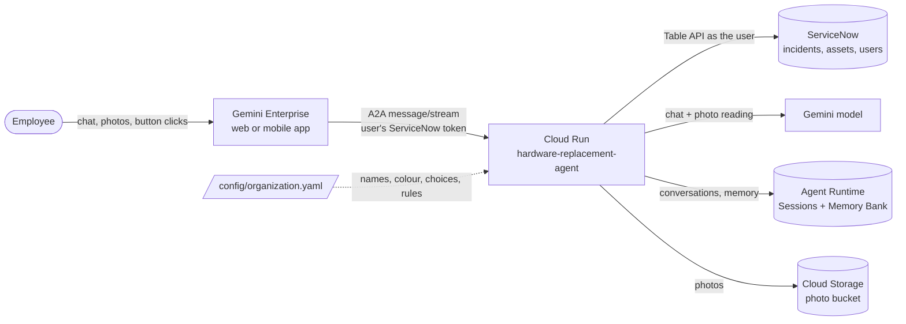
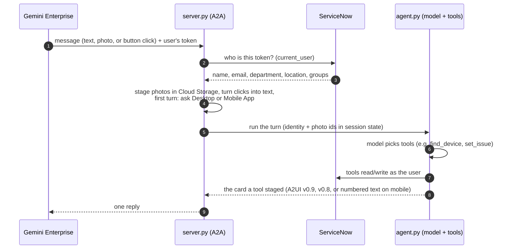
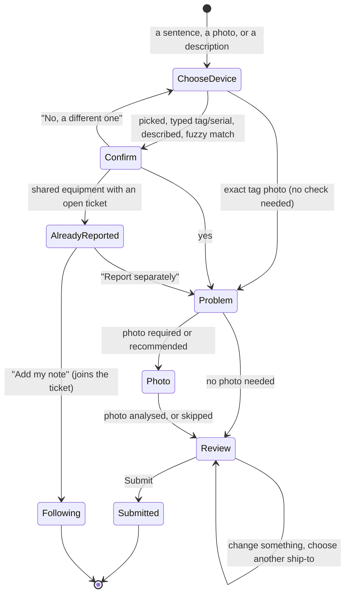
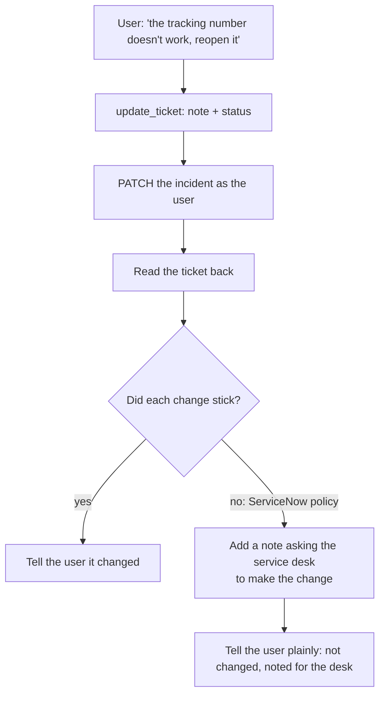
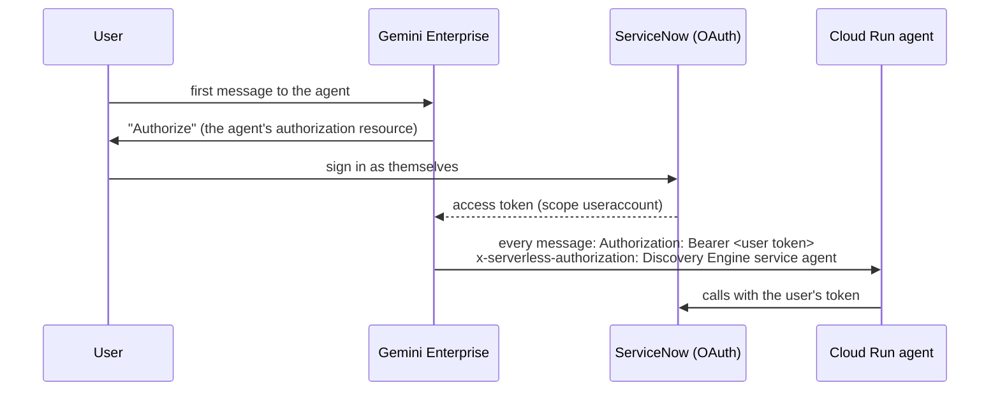

# Architecture

How the Hardware Replacement agent works, in five diagrams and a module map. The HTML version
of these docs is `docs/site/index.html`.

## 1. The pieces

- **Gemini Enterprise** hosts the chat. It signs each user in to ServiceNow (OAuth authorization
  code) and forwards that user's token with every message.
- **Cloud Run** runs the agent (ADK + an A2A server). It holds **no ServiceNow credentials**: every
  ServiceNow call uses the signed-in user's token, so ServiceNow's own permissions apply.
- **Agent Runtime** is used only for its managed Sessions (the conversation) and Memory Bank (what
  the agent remembers about a person). It runs no code. The agent itself stays on Cloud Run because
  an A2A agent on Agent Runtime does not receive the user's credential (measured).
- **Cloud Storage** keeps the photos a user sends; on submit they are copied onto the ticket.

## 2. One turn

The model never writes card JSON. Tools build every card in `app/cards.py` and "stage" it; the
model's one-sentence reply becomes the card's first line (`agent.render_staged_card`).

## 3. A request, step by step

- Steps are **skipped** when already known: one sentence ("my laptop won't turn on, demo
  tomorrow") can jump straight to review.
- **Device kinds** decide the path: *personal* (assigned to a person: replaced and shipped),
  *shared* and *clinical* (owned by a department: repaired on site by the asset's support group).
- **Ownership** is checked, never enforced: yours, your department's, your group supports it, or
  "could not be confirmed" (written on the ticket).

## 4. Changing a ticket: attempt, verify, say what happened

ServiceNow drops fields a user may not set **without an error**, so nothing is reported as done
until it is read back (`tools._apply_changes`). The same rule covers ticket creation: a dropped
description goes into the first note, a lower priority than requested is explained.

## 5. Sign-in and identity

- Cloud Run IAM admits only Gemini Enterprise's service agent (`run.invoker` on the service).
- The user's token lives for one request in a `ContextVar`: never in session state, memory or logs.
- Sessions are keyed by the A2A conversation id; memory is keyed by the user's email.

## Module map: to change X, look in Y

| To change | Look in |
|---|---|
| Names, colour, problem choices, photo and urgency rules, response targets, texts | `config/organization.yaml` (no code) |
| Project, region, ServiceNow instance, model | `.env` (see `.env.example`) |
| What the agent is told (routing rules) | `app/agent.py` `_FLOW`; persona in the profile |
| Card layout | `app/cards.py` |
| Steps, device matching, ownership, addresses, ticket changes | `app/tools.py` |
| ServiceNow calls and field mapping | `app/servicenow.py` |
| Who the user is | `app/identity.py` |
| Photos in, clicks in, desktop/mobile question | `app/inbound.py` |
| Photo reading prompt | `app/vision.py` |
| Memory and saved addresses | `app/memory.py` |
| A2A server, agent card, per-turn plumbing | `app/server.py` |
| Settings and profile loading | `app/config.py`, `app/profile.py` |
| Deploy, setup, permission check, demo data | `scripts/`, `seed/` |

## Why it is built this way

| Decision | Reason |
|---|---|
| Cloud Run, not Agent Runtime, for the agent | An A2A agent on Agent Runtime does not receive the Gemini Enterprise user's credential; Cloud Run passes it through. |
| Per-user ServiceNow OAuth | Tickets are filed and read as the real person, with their permissions; the agent stores no ServiceNow secret. |
| Deterministic cards | The model chooses steps; Python builds the UI, so a card can't be malformed or show invented values. |
| A2UI v0.9, v0.8 fallback | v0.9 renders better and takes the brand colour; v0.8 is sent to clients that still ask for it. |
| "Desktop or Mobile App?" | The mobile app renders no A2UI and sends the same request as the web app, so it can't be detected. |
| Attempt, verify, note | ServiceNow silently drops fields a user can't set. |
| Verbatim saved addresses | Memories written from conversations are paraphrased and can't tell a hotel from a home. |
